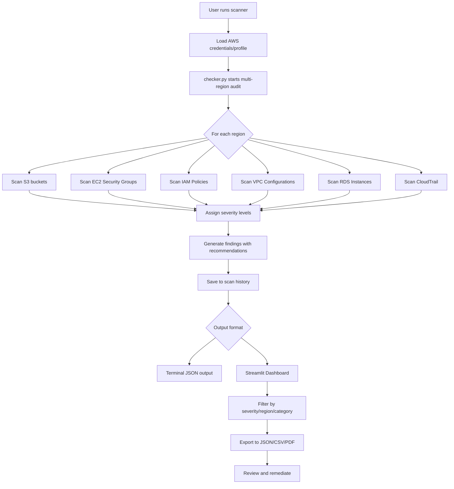

# AWS Security Scanner

## Description / Overview
AWS Security Scanner is a comprehensive Python-based security auditing tool that scans AWS resources for misconfigurations across multiple services and regions. The tool helps identify insecure settings across your cloud environment and presents findings with severity ratings, DORA compliance mappings, and actionable remediation recommendations.

Scans can be run via command line or through an interactive Streamlit dashboard with filtering, historical tracking, and multiple export formats (JSON, CSV, PDF).

## Features
- **Multi-region scanning** - Scan all configured AWS regions in one operation
- **Comprehensive service coverage** - S3, EC2 Security Groups, IAM, VPC, RDS, CloudTrail
- **Severity-based classification** - Critical, High, Medium, Low priority ratings for findings
- **Interactive Streamlit dashboard** - Filter by severity, region, and category
- **Historical scan tracking** - Compare findings over time with automated scan history
- **Multiple export formats** - JSON (raw data), CSV (tabular), and PDF (formatted reports)
- **Actionable remediation recommendations** - Get specific guidance for each finding
- **DORA compliance mapping** - Built for financial institutions compliance needs
- **Color-coded severity badges** - Visual identification for quick prioritization
- **Real-time scanning** - Run scans on-demand through the dashboard
- **Automated backups** - All scans saved with timestamps to scan_history/

**Services Scanned:**
- **S3**: Public access, encryption, versioning, logging
- **EC2 Security Groups**: SSH/RDP/DB ports, internet exposure
- **IAM**: MFA status, wildcards, permissions review
- **VPC**: Internet gateways, NACLs, flow logs
- **RDS**: Public access, encryption, backups, Multi-AZ
- **CloudTrail**: Logging status, validation, multi-region trails

**Severity Levels:**
- 🔴 **Critical** - Immediate action required (SSH open to internet, public RDS)
- 🟠 **High** - Address urgently (no encryption, missing MFA)
- 🟡 **Medium** - Should be reviewed (no versioning, missing backups)
- 🟢 **Low** - Best practice recommendations (HTTPS exposed)

## Tech Stack
- **Python 3.8+** - Core programming language
- **Boto3** - AWS SDK for Python
- **Streamlit** - Interactive web dashboard framework
- **Pandas** - Data processing and manipulation
- **FPDF** - PDF report generation
- **python-dotenv** - Environment configuration management

## Architecture / System Design


## Installation & Setup

### 1. Clone the repository
```bash
git clone https://github.com/suvadityaroy/AWS-Security-Scanner.git
cd AWS-Security-Scanner
```

### 2. Create and activate virtual environment
```bash
# Create virtual environment
python -m venv venv

# Activate - Windows
venv\Scripts\activate

# Activate - macOS/Linux
source venv/bin/activate
```

### 3. Install dependencies
```bash
pip install -r requirements.txt
```

### 4. Configure AWS credentials
Choose one of these methods:

**Option A: AWS CLI**
```bash
aws configure
```

**Option B: Environment variables**
```bash
# Windows PowerShell
$env:AWS_ACCESS_KEY_ID="your-access-key"
$env:AWS_SECRET_ACCESS_KEY="your-secret-key"
$env:AWS_DEFAULT_REGION="us-east-1"

# Linux/macOS
export AWS_ACCESS_KEY_ID="your-access-key"
export AWS_SECRET_ACCESS_KEY="your-secret-key"
export AWS_DEFAULT_REGION="us-east-1"
```

### 5. (Optional) Configure regions to scan
Create a `.env` file in the project root:
```
AWS_REGIONS=us-east-1,eu-west-1,ap-south-1
```
If not specified, defaults to `eu-north-1`

### 6. Run the scanner

**CLI mode (JSON output):**
```bash
python checker.py
```

**Streamlit dashboard mode:**
```bash
streamlit run streamlit.py
```

Access the dashboard at `http://localhost:8501`

### Required AWS Permissions
The scanner requires read-only access. You can use the AWS managed policy `SecurityAudit` or create a custom policy with:
- S3: `s3:GetBucket*`, `s3:ListBucket*`
- EC2: `ec2:Describe*`
- IAM: `iam:Get*`, `iam:List*`
- RDS: `rds:Describe*`
- CloudTrail: `cloudtrail:Describe*`, `cloudtrail:GetTrailStatus`

## Author / Contact
**Suvaditya Roy**  
GitHub: [@suvadityaroy](https://github.com/suvadityaroy)

---

*This tool is designed for security auditing in environments you own or have permission to scan. Always follow your organization's security policies and AWS best practices.*
